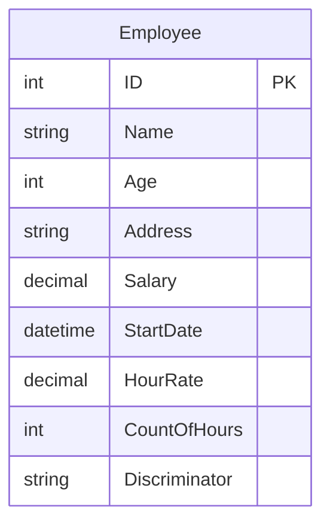
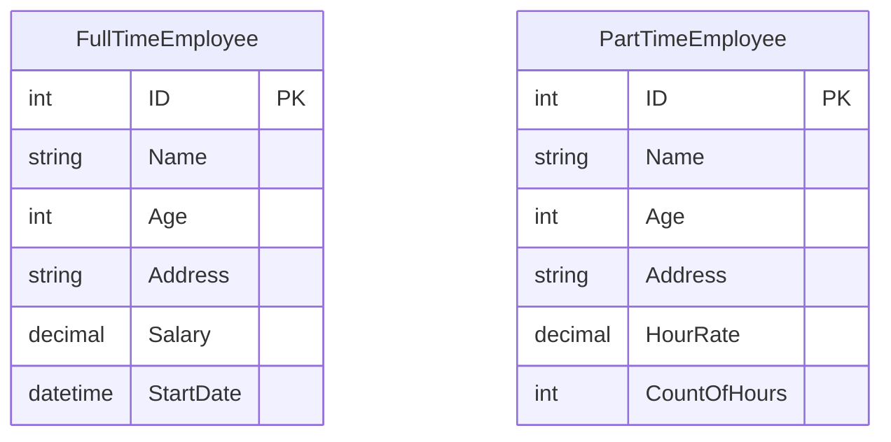

# Entity Framework Core - ORM Overview

## What is an ORM?

An Object-Relational Mapper (ORM) is a tool that enables mapping between:
- Application objects (Desktop, Mobile, or Web applications)
- Database relations (tables)

### Key Concepts
- **Object**: Instance of a class in your application
- **Relation**: Table in your database schema
- **Mapping**: Converting between objects and relations bidirectionally

### Benefits
- Focus on one development approach (either object-oriented or database-first)
- Abstract away direct database interactions
- Reduce database vendor lock-in
- Write database operations in your application's native language

## Entity Framework Core

Entity Framework Core is Microsoft's official ORM for .NET applications. For .NET 6 applications, we use Entity Framework Core 6.

### Mapping Approaches

There are two main approaches to mapping in EF Core:

| Approach | Direction | Description | Common Use Case |
|----------|-----------|-------------|----------------|
| Code First | Classes → Database | Generate database tables and views from your code | New projects, domain-driven design |
| Database First | Database → Classes | Generate classes from existing database schema | Legacy database integration |

#### Why Code First is Popular
- Easier development workflow
- Better control over the development cycle
- Changes start in the code
- Version control friendly
- Supports agile development practices

### Working with Data

Instead of writing raw SQL, EF Core allows you to:
1. Write LINQ queries (LINQ to Entities - L2E)
2. Query against remote sequences (tables, views, functions)
3. Operate on object models that represent database rows

### Object-Database Mapping Reference

| Application Concept | Database Equivalent |
|--------------------|---------------------|
| Object Model | Database Table |
| Object Instance | Table Row |
| Property | Column |
| LINQ Query | SQL Query |

### Key Operations
All database operations are performed through C# code:
- Create (Insert)
- Read (Select)
- Update
- Delete

These operations are written in LINQ and automatically converted to appropriate SQL commands by EF Core.

# Entity Framework Core - Inheritance Mapping Strategies

## Understanding Inheritance Mapping

When working with inheritance in Entity Framework Core, the way classes are mapped to database tables significantly impacts application performance and maintainability.

## Class Structure Example

Consider an inheritance hierarchy with employees:

## Table Per Class (TPC) Strategy

### Overview
TPC is the default inheritance mapping strategy in EF Core. With this approach:
- Each concrete class in the inheritance hierarchy gets its own database table
- Each table contains columns for all properties (inherited and declared)

### Database Schema with TPC

### Disadvantages of TPC

1. **Data Redundancy**
   - Common properties are stored in multiple tables
   - Increases storage requirements
   - Complicates data maintenance

2. **Performance Impact**
   - CRUD operations require multiple table access
   - Creating a new employee requires inserts into multiple tables
   - Queries often need JOIN operations

3. **Operational Complexity**
   - Updates and deletes must maintain consistency across tables
   - More complex query generation
   - Higher chance of data inconsistency

### When to Avoid TPC
- In scenarios with deep inheritance hierarchies
- When performance is a critical requirement
- When data consistency is paramount
- In systems with high transaction volumes

### Code First Considerations
When working Code First:
- TPC is applied by default
- Consider carefully whether this is the best approach for your use case
- Alternative mapping strategies might be more appropriate

## Best Practices
1. Evaluate inheritance mapping strategy early in design
2. Consider the trade-offs between storage, performance, and complexity
3. Don't automatically accept the default TPC strategy
4. Test performance with representative data volumes

# Entity Framework Core - Advanced Inheritance Mapping Strategies

## Table Per Hierarchy (TPH)

TPH is an alternative to TPC that stores the entire inheritance hierarchy in a single table.

### Single Table Structure

### Key Characteristics
1. **Discriminator Column**
   - Automatically added by EF Core
   - Acts as an enum to identify row type (FullTime/PartTime)
   - Helps distinguish between different types of employees

2. **Advantages**
   - Single table for all operations
   - Simpler querying
   - Better performance for CRUD operations
   - No need for table joins

3. **Disadvantages**
   - NULL values for non-applicable fields
   - Less efficient storage utilization
   - Potential for wide tables with many nullable columns

## Table Per Concrete Class (TPCC)

Introduced in 2019, TPCC maps only concrete classes to database tables.

### Database Schema

### Key Features
1. **Concrete Classes Only**
   - Only maps classes with actual business representation
   - Base/abstract classes (like Employee) are not mapped
   - Improved storage efficiency

2. **Advantages**
   - No nullable columns
   - Clean database design
   - Better storage efficiency
   - Single table operations for CRUD
   - Maps closely to business entities

3. **Use Cases**
   - When abstract classes are purely for code organization
   - When storage efficiency is important
   - When clear separation between types is needed

## Choosing the Right Strategy

### Comparison Matrix

| Feature | TPC | TPH | TPCC |
|---------|-----|-----|------|
| Storage Efficiency | Poor | Medium | Good |
| Query Performance | Poor | Good | Good |
| NULL Values | No | Yes | No |
| Table Count | Many | One | Few |
| Maintenance | Complex | Simple | Medium |

### Database Vendor Support
- SQL Server
- MySQL
- PostgreSQL
- Other vendors supported by EF Core

### Best Practices
1. Consider TPCC for new projects
2. Use TPH when storage isn't a primary concern
3. Avoid TPC unless specifically required
4. Test performance with realistic data volumes
5. Consider the specific requirements of your chosen database vendor
